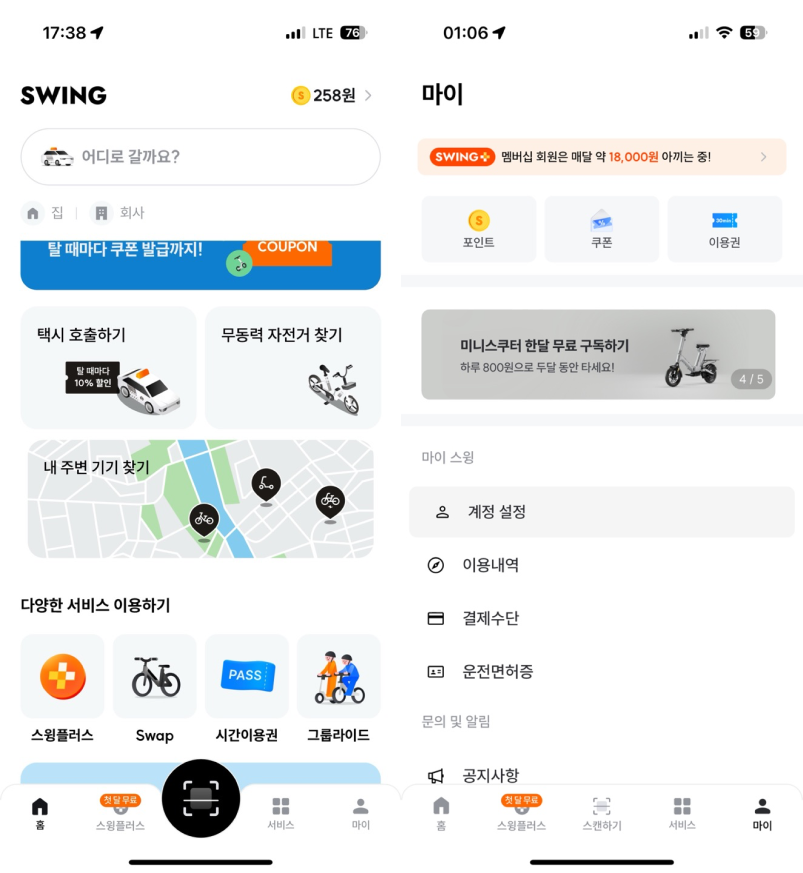
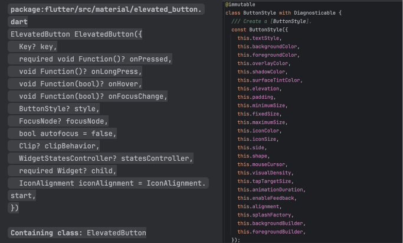
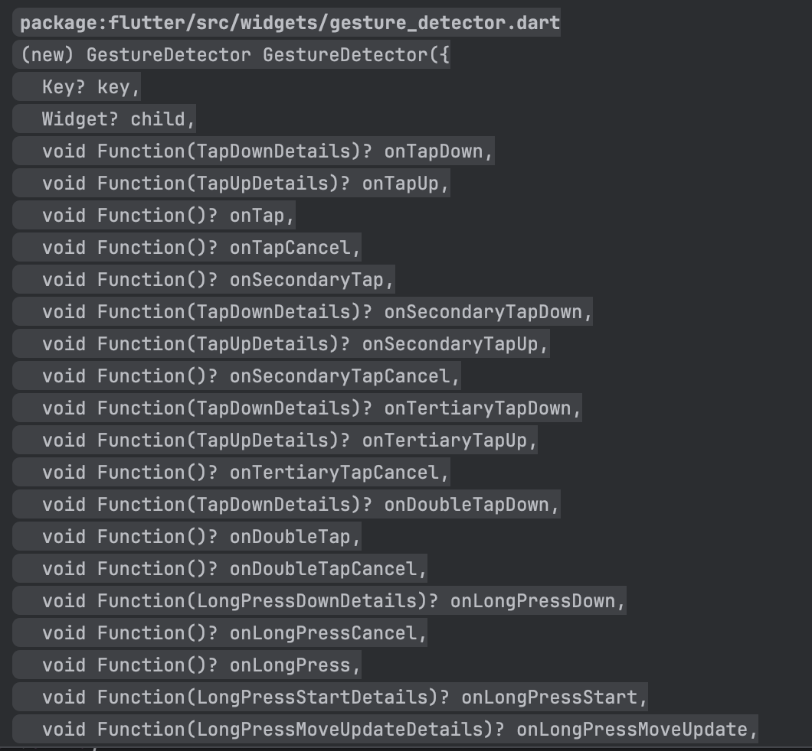

## Scale Button을 만드는 이유



최근 들어 Swing을 자주 이용하고 있는데 누를 때마다 크기가 변하는 버튼들이 되게 아기자기 하고 귀엽습니다.

마침 제 최애작 **노티노티**도 오픈소스로 공개하기 위해 처음부터 작업을 다시 진행하고 있는데 여기에 한번 사용해보기로 마음을 먹었습니다.

## 동작 이해하기

버튼의 Scale Animation 동작 방식은 다음과 같습니다.

1. onTap(onPress)**하는 중**일 때 Scale이 줄어들게 Animation 적용함.
2. Tap이 끝나면 Scale이 다시 원상 복구함.

뭐 사실 별 거 없죠? 그럼 이제 어떤 위젯을 잘 쌓아가면서 만들어야 할까요?

## 잘못 접근하기

저는 `Material(Elevated, Outlined, Text)` 버튼과 `Cupertino` 버튼을 사용해본 적이 있습니다.

우선 `CupertinoButton`은 `ripple effect`와 `shadow`가 없고 `opacity`가 변하는 버튼임과 동시에 디자인과 관련한 속성을 제어할 수 없습니다. 따라서, Material의 `ElevatedButton`의 속성을 수정하면서 Animation을 적용해야겠다고 생각했습니다.



Material - `ElevatedButton`, `OutlinedButton`, `FilledButton`, `TextButton`의 style은 전부 `ButtonStyle`을 속성으로 사용하고 있습니다.

열심히 foregroundColor, shadow, elevation등 전부 바꿔가며 기존 버튼이 가지고 있는 속성을 없애려고 노력했습니다. 기존 속성을 없애고 Animation을 추가할 거니까요.

하지만 저희는 이걸 수정할 이유가 없습니다. 아무 효과가 없는 `Container`에서 크기만 변하는 `Animation` 효과만 추가하면 그게 버튼이기 때문이죠.. 바보 같이 삽질을 열심히 한 저에게 박수를 보내주세요.😢

## 구현하기

구현 프로세스는 간단합니다.



`GestureDetector`라는 위젯에는 아무런 효과 없이 위와 같은 엄청 많은 Event Listener를 속성으로 가지고 있습니다. 저희는 여기서 `onTapDown`, `onTapCancel`, `onTapUp`일 때의 상태를 체크해 `AnimatedScale` 위젯을 사용하여 크기를 변화시킬 겁니다.

- `onTapDown` -> 버튼의 크기 줄어들기
- `onTapCancel` -> 줄어든 버튼 크기 복구
- `onTapUp` -> 줄어든 버튼 크기 복구

### 코드

```dart
import 'package:flutter/material.dart';

class ScaleButton extends StatefulWidget {
  const ScaleButton({super.key, required this.onPressed, required this.child});

  final void Function() onPressed;
  final Widget child;

  @override
  State<ScaleButton> createState() => _ScaleButtonState();
}

class _ScaleButtonState extends State<ScaleButton> {
  bool _isPressed = false;

  @override
  Widget build(BuildContext context) {
    return GestureDetector(
      onTapDown: (_) {
        setState(() {
          _isPressed = true;
        });
      },
      onTapCancel: () {
        setState(() {
          _isPressed = false;
        });
      },
      onTapUp: (_) {
        setState(() {
          _isPressed = false;
        });
      },
      onTap: widget.onPressed,
      child: AnimatedScale(
        scale: _isPressed ? 0.95 : 1.0,
        duration: const Duration(milliseconds: 200),
        curve: Curves.easeInOut,
        child: ClipRRect(
          borderRadius: BorderRadius.circular(16),
          child: widget.child,
        ),
      ),
    );
  }
}
```

## 결과


-끗-
