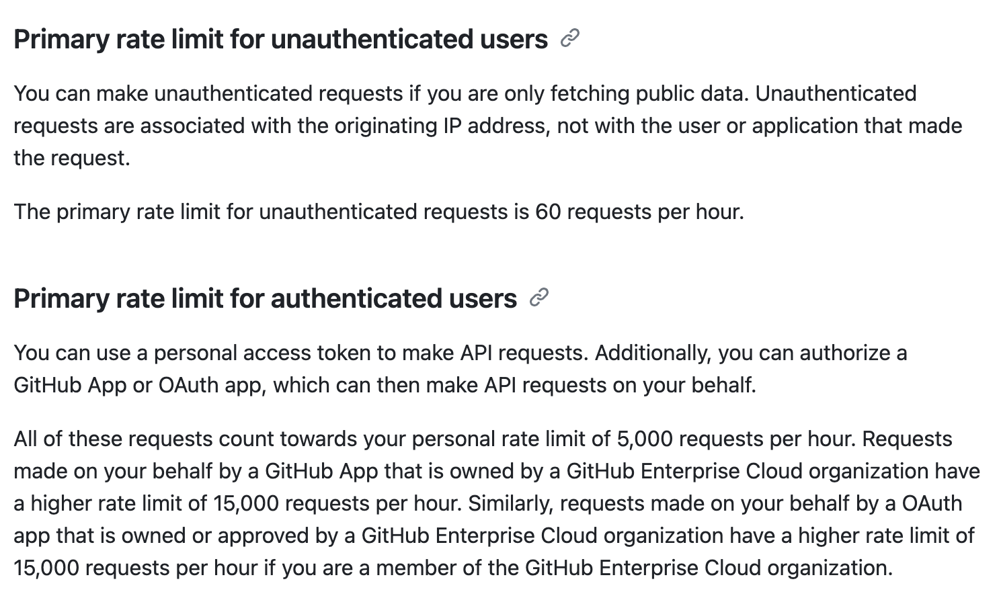
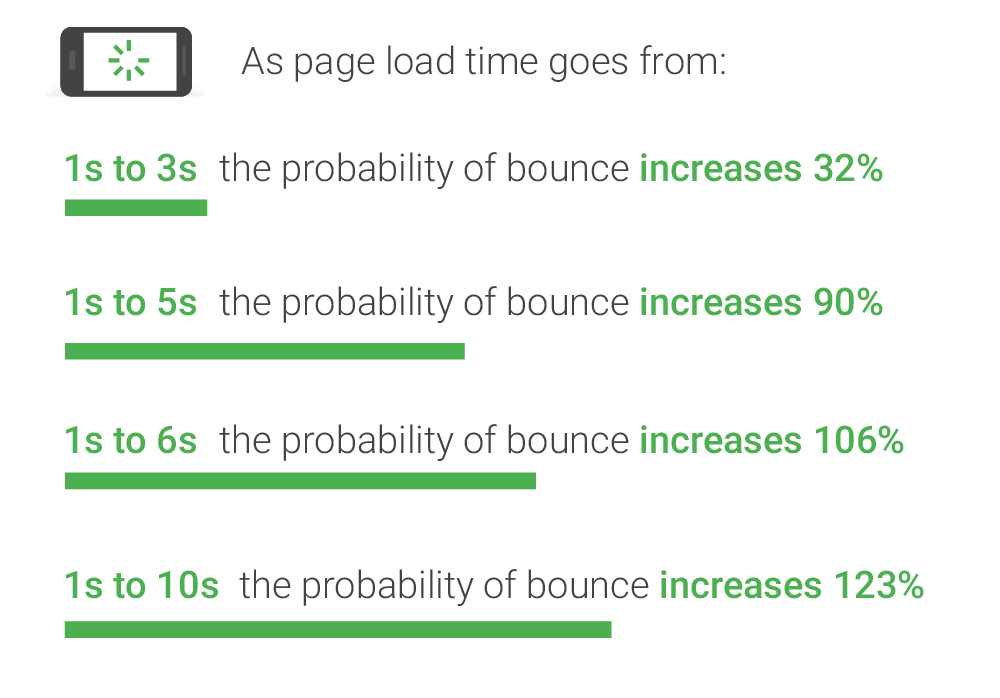

> 글이 장황하고 회고 형식이라 기술 내용과는 거리가 있을 수 있습니다. 핵심 기술은 다음 편에 작성합니다.

## 왜 만들었나

지금 개발자로서 살아가는 이 시대에 나의 역량을 보여주고, 차별화를 주기 위해서는 한 번쯤은 나만의 블로그를 만들고 싶다는 생각을 했다.

기존의 블로그 서비스는 많았지만, 콘텐츠가 플랫폼에 종속되어있거나 혹은 자유도가 너무 높아 블로그 세팅 조차 어려워졌던 경험을 했다. 이런 사람들이 더욱이 많을 거라 생각해 새로운 형태의 블로그 플랫폼을 만들어보기로 했다. 웹이라고는 Tutorial hell에 갇혀 손가락만 쪽쪽 빨아본 게 전부였기에 새로운 도전이었다.

이 글에서는 블로그 플랫폼을 기획하고 개발하면서 겪은 경험과 배운 점들을 정리해보려 한다.

## 아이디어의 시작

처음에는 단순한 개인 블로그를 만들 생각이었다. 하지만 점점 생각이 발전하면서, 다른 개발자들이 쉽게 블로그를 운영하면서도 서로 연결될 수 있는 플랫폼을 만들고 싶어졌다.

특히 GitHub과 연동하여 개발자가 자신의 콘텐츠 소유를 확실히 보장할 수 있는 방식은 어떨까 생각이 들었다.

## 기술 스택 선택

개발을 시작하기 전부터 배포하기까지 어떤 기술을 사용할지 계속 고민했다. 웹을 프로덕션 레벨까지 구현해보는 건 처음이기에 문서가 잘 되어있고 대중적인 걸 해야겠다는 생각이 컸다.

- **프론트엔드**: Next.js (백엔드 통합 및 SSR/SSG/ISR 방식이 적합하다고 판단)
- **백엔드**: Next.js (빠른 개발을 위해 통합 환경 사용)
- **데이터베이스**: PostgreSQL(Supbase - API Key, 블로그 metadata 저장)

> **[고려했던 것들]**
>
> `Remix`를 공부하고 적용해보려고 했지만 React Router의 Framework로 편입되면서 문서만 보고 작업하기가 어려워 `Next.js`를 선택했다.
>
> `Nest.js`, `Strapi` 등을 이용해 백엔드를 따로 구현할까 했지만 프로젝트의 크기나 사용성에 비해 너무 과하다고 판단했다.
>
> `Redis`를 이용해 metadata를 캐싱하는 방식으로 개발했지만 90일 뒤에 Trial이 끝나기에 사용하고 있던 Supabase Database로 편입했다.

이 외에도 GitHub를 사용자의 Content Management System으로 사용할 수 있게 구현했다.

## 개발 과정에서의 고민과 문제 해결

기능 하나하나에 대한 고민과 문제는 별 상관이 없다. 그 기능 하나의 문제가 그 옆의 기능들에 영향을 주고 결국은 전체로 번질 수밖에 없는 것이 무섭다.

결국에는 기획의 부족함.

### 글을 어디에 저장할 것인가

일반적인 블로그 플랫폼과 달리, 사용자가 자신의 GitHub 저장소를 통해 글을 관리할 수 있도록 하고 싶었다. [giscus (댓글 위젯)](https://giscus.app)로부터 감명을 받아 블로그도 비슷하게 동작할 수 있지 않을까 생각했다.

이와 같은 방식으로 구현하면 사용자 자신의 글을 플랫폼에 종속시키지 않고, 원본 데이터를 가지고 있을 수 있다는 점에서 사용자에게 차별화를 줄 수 있다고 판단했다.

### GitHub API 호출 횟수 제한

REST API 기준 미인증된 유저에게는 시간당 60번의 request를 사용할 수 있고, 인증된 유저는 시간당 5,000번의 request를 보낼 수 있다.

나는 GitHub App을 통해 인증된 유저로 API 호출을 할 수 있기에 유저당 1시간에 5,000번의 request를 할당 받을 수 있다.

시간당 5,000번으로 커버가 가능할까?

글을 하나 읽기 위해서는 1번 이상의 API 호출이 필요하다. 극한으로 따져서 5,000명의 사람이 한 시간 안에 글을 한 번만 본다고 해도 그 이후로는 리밋이 걸려 글을 볼 수 없는 상황에 처해진다.

글을 가져오는 방식을 조금 다르게 구성해야하지 않을까?

### 캐싱과 성능 최적화

**GitHub 저장소에서 블로그 데이터를 직접 가져오면 속도가 느려질 수밖에 없다.**

처음에는 단순하게 생각했다.

> 사용자가 블로그 Repository에 푸시를 하면 Webhook을 통해 해당 저장소를 읽고 metadata를 해당 저장소에 저장하면 되겠구나.
>
> 이후에는 클라이언트에서 metadata를 우선 다운로드 후 적혀있는 글의 path를 통해 글을 읽어와야지.

GitHub App을 통해 저장소에 접근, 수정을 할 수 있고, `Octokit SDK`를 통해 글을 하나하나 읽어올 수 있었다. 좋다. 구현까지는 문제가 없다.

다만, `Octokit SDK`로 콘텐츠를 다운 받는 시간이 생각보다 오래 걸린다는 걸 깨달았다. 평범한 사이즈의 콘텐츠 2개를 다운 받는 데에는 무려 1500ms 이상이 소요되며, 렌더링 시간까지 합하면 거즘 2500ms 정도의 시간이 걸렸다.

리서치에 따르면 모바일 웹 로딩 시간이 3초 이상이 걸릴 때 32%, 5초 이상은 90%, 6초 이상은 106%, 10초가 넘으면 123% 정도의 이탈률이 생긴다고 한다.

이 문제가 프로덕션까지 도달하지 않게 하기 위해서는 반드시 고쳐야했다.

또 다른 문제점도 있다. 과연 저장소를 읽는 걸 넘어서 metadata를 만들고 저장하기 위해 write 권한까지 필요하게 만드는 게 맞을까? 신뢰성의 문제도 있다. 적어도 개인으로 운영하는 사람의 App을 사용자가 전부 믿을 수는 없다.

하나의 기능으로부터 이 두 가지의 문제점에 도달했다. GitHub REST API Limit 문제도 포함할 수 있다.

기존의 작동 방식은 이렇다. 우선 한 유저의 글 하나를 보기 위해서는 총 두 개의 데이터를 다운 받아와야 한다. 하나는 `metadata.json`, 또 다른 하나는 글 내용이 담긴 `content.md` 파일이다.

매번 새롭게 접속할 때마다 `metadata.json` 파일을 다운로드 하고, 글 하나하나를 보기 위해 각 글에 해당하는 `content.md` 파일을 지속적으로 다운받아와야 한다.

새로운 방식을 고안했다. 모든 글과 필요한 metadata를 외부 데이터베이스에도 함께 저장하기로 했다. 캐싱 기능 혹은 ISR - On demand 방식을 고려해보고자 계속 찾아보다가 데이터베이스에 저장하는 게 적합하다고 판단했다. 사용자가 새롭게 글을 업데이트 하면 Webhook이 외부 데이터베이스도 동일하게 업데이트 할 수 있게 해준다.

이로써 Repository에 쓰기 권한을 없애고 글을 데이터베이스로부터 가져오게 하여 렌더링 속도를 높일 수 있었다.

> TLDR;
>
> `[기존 방식]` - 글 업데이트 할 때마다 `metadata.json` 생성 및 Repository에 저장 + Repository에 접근하여 글을 다운로드 받고 String으로 Parse 및 렌더링
>
> `[새로운 방식]` - 글 업데이트 할 때마다 `metadata`와 모든 글을 database에 따로 저장, 데이터베이스에 접근하여 데이터 가져옴

원본 데이터에는 무결성이 생기는 셈이다.

## 앞으로의 계획 및 로드맵

현재 블로그 플랫폼은 기본적인 기능을 갖추었지만, 앞으로 더 발전시킬 계획이다.

1. **Editor 지원 및 글 등록 기능**: 현재는 글을 보여주는 것이 전부지만, 에디터와 글 등록 기능을 추가하여 완성도 높일 계획

   > 부가적으로 글을 등록할 때 인증을 어떻게 할지 고민 - GitHub Auth를 도입?

2. **커뮤니티 기능 강화**: 사용자들이 서로 연결될 수 있도록 팔로우 기능 추가

   > 팔로우 하면 GitHub Email로 새로운 글이 도착했다고 보내주는 기능?
